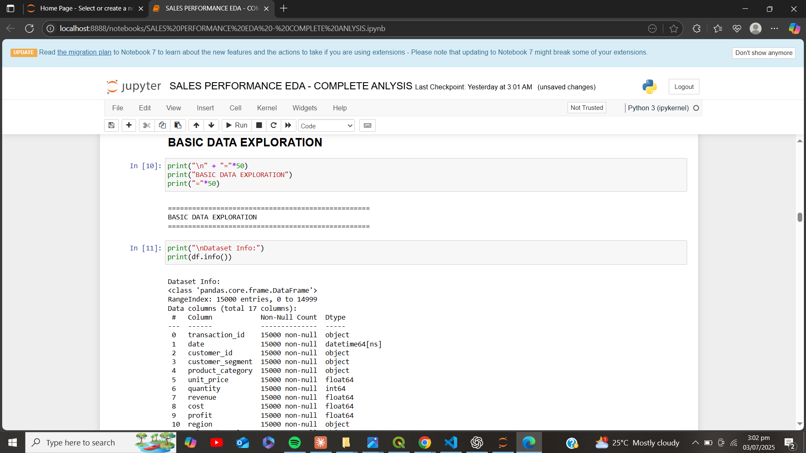
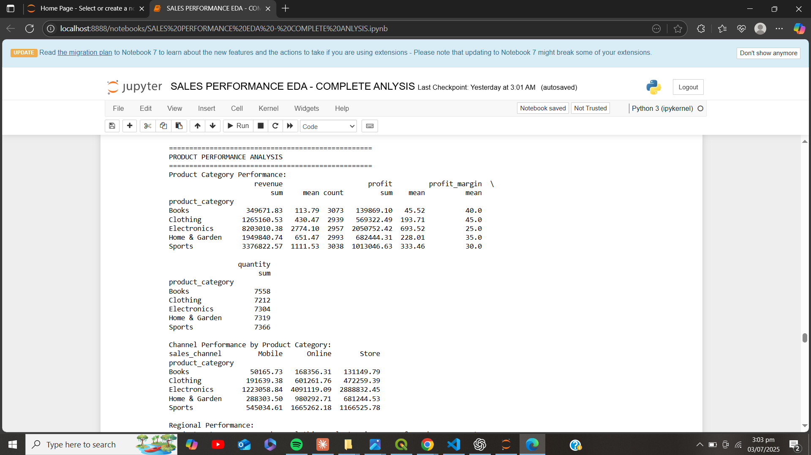
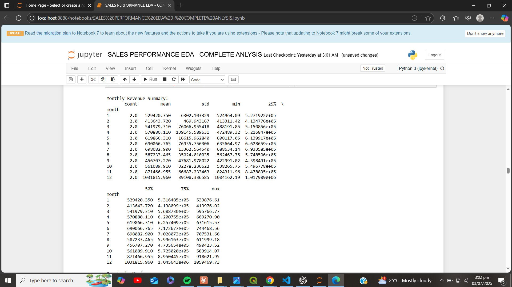
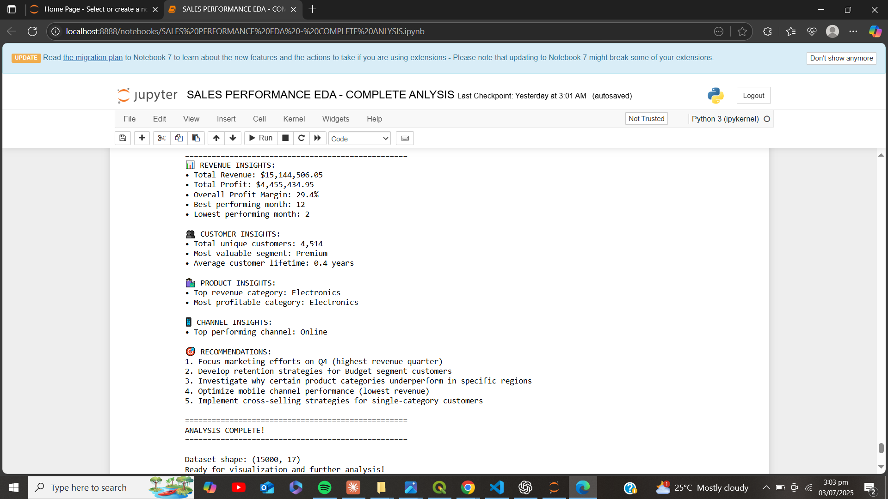

# 📊 Sales Performance EDA

A comprehensive **Exploratory Data Analysis (EDA)** project focused on uncovering trends, key performance indicators, and actionable insights from sales data using Python. The goal is to assist business stakeholders in understanding sales dynamics and making data-driven decisions.

---

## 📁 Project Structure

```
sales-performance-eda/
│
├── SALES PERFORMANCE EDA.ipynb        # Main notebook with full analysis
├── data/
│   └── sales_data.csv                 # Raw or cleaned data (optional)
├── images/
│   └── (All visuals and charts here)
├── README.md                          # Project documentation
├── requirements.txt                   # Python libraries used
└── .gitignore                         # Files to ignore in version control
```

---

## 🧰 Tools & Technologies Used

- Python 3.x
- Pandas
- NumPy
- Matplotlib
- Seaborn
- Jupyter Notebook

---

## 🔍 Key Analysis Performed

- Basic Data Exploration & Cleaning  
- Revenue Trends Over Time  
- Product & Customer Performance Analysis  
- Customer Segmentation  
- Statistical Testing & Correlation  
- Monthly Revenue Trends  
- Actionable Business Recommendations

---

## 📸 Sample Output Visuals

### 📌 Basic Data Exploration


### 👥 Customer Segment Analysis


### 📦 Product Performance Analysis


### 📈 Monthly Revenue Summary


### 📊 Statistical Testing & Correlation


### 📑 Final Insights & Recommendations


---

## 📌 Key Insights

- 📈 **Strong seasonal trends** observed in Q4 sales across multiple years.
- 🥇 **Top-selling products** significantly contribute to total revenue.
- 🌍 **Certain customer segments and regions** consistently outperform others.
- ⚠️ **Statistical tests** reveal strong positive correlations between discount rate and revenue drop.
- ✅ Clear recommendations proposed for product bundling and segmentation-based campaigns.

---

## 🚀 How to Run This Project

1. Clone this repository:
   ```bash
   git clone https://github.com/your-username/sales-performance-eda.git
   ```

2. Navigate into the folder:
   ```bash
   cd sales-performance-eda
   ```

3. Install dependencies:
   ```bash
   pip install -r requirements.txt
   ```

4. Launch the notebook:
   ```bash
   jupyter notebook "SALES PERFORMANCE EDA.ipynb"
   ```

---

## 🪪 License

This project is licensed under the MIT License — see the LICENSE file for details.

---

## 🙌 Acknowledgments

- Data Source: [Specify here if public, or write "Synthetic dataset generated for demo purposes."]
- Special thanks to the Python data analysis ecosystem and the open-source community.
"# sales-performance-eda" 
"# sales-performance-eda" 
